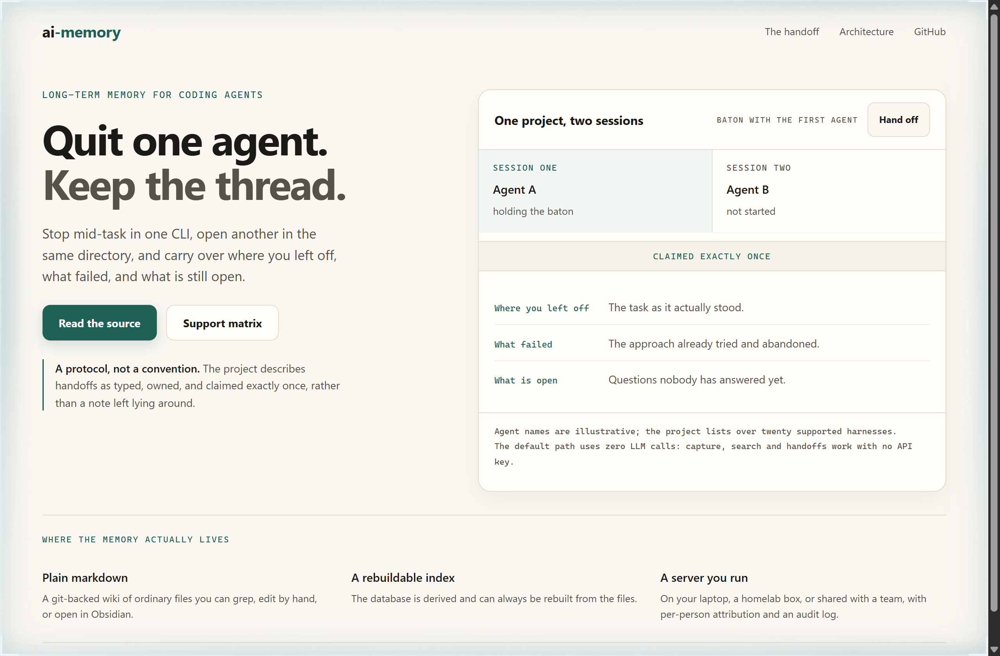
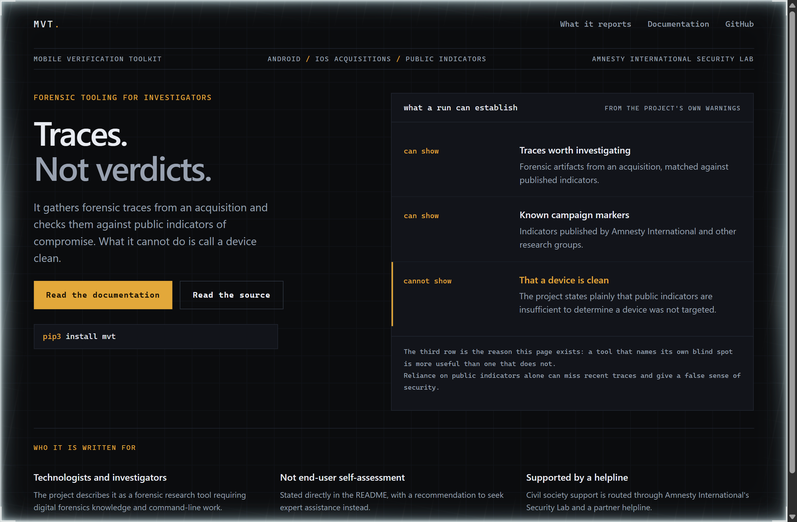
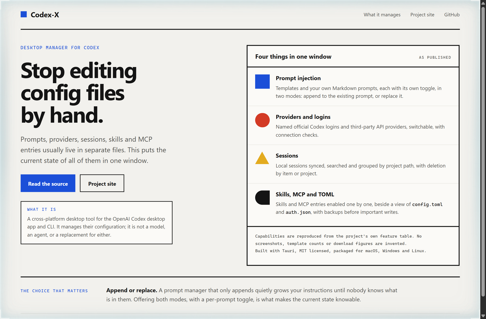

# Design Rep — Monday, September 21

> 3 mocks — warm-minimal, hud, bauhaus

[Catalog](../../CATALOG.md) · [Home](../../README.md)

## [akitaonrails/ai-memory](https://github.com/akitaonrails/ai-memory)

- **Style:** warm-minimal / archive-teal
- **Idea tested:** Draw the handoff as a baton that moves between two lanes and can only sit in one
- **Verdict:** Exactly one active lane is the protocol claim made visible; a paragraph would have made it sound optional
- [live .html](./01-ai-memory.html) · [repo on GitHub](https://github.com/akitaonrails/ai-memory)

## [mvt-project/mvt](https://github.com/mvt-project/mvt)

- **Style:** hud / instrument-amber
- **Idea tested:** Give the limitation its own row in the readout rather than a footnote
- **Verdict:** A cannot-show row rendered in the accent colour is the most credible thing on the page
- [live .html](./02-mvt.html) · [repo on GitHub](https://github.com/mvt-project/mvt)

## [yynxxxxx/Codex-X](https://github.com/yynxxxxx/Codex-X)

- **Style:** bauhaus / primary-blue
- **Idea tested:** Give each scattered configuration surface its own geometric mark so the scope is countable
- **Verdict:** Four shapes make a config manager legible in a glance and keep the scope honestly bounded
- [live .html](./03-codex-x.html) · [repo on GitHub](https://github.com/yynxxxxx/Codex-X)
