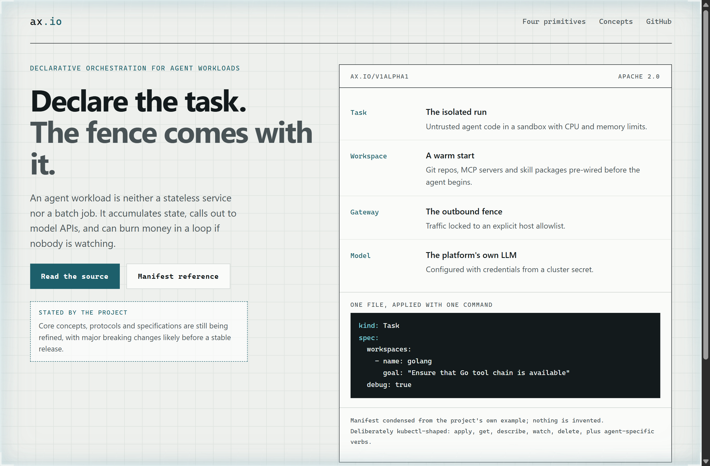
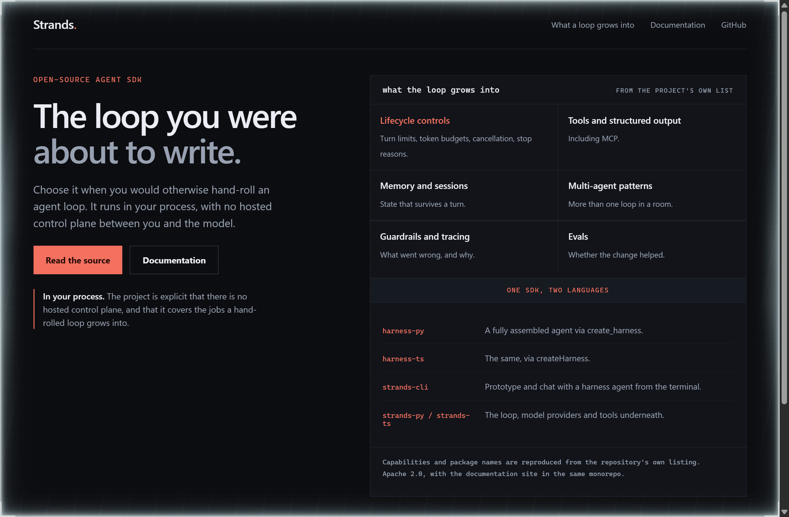
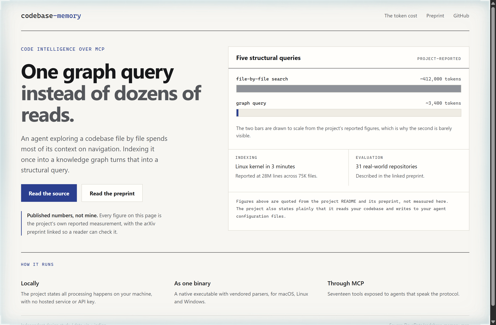

# Design Rep — Wednesday, September 23

> 3 mocks — blueprint, neon-noir, data-viz

[Catalog](../../CATALOG.md) · [Home](../../README.md)

## [google/ax](https://github.com/google/ax)

- **Style:** blueprint / drafting-teal
- **Idea tested:** Lead with the four primitives and the fence rather than the throughput claim
- **Verdict:** Naming Gateway beside Task is what makes the orchestration argument land
- [live .html](./01-ax.html) · [repo on GitHub](https://github.com/google/ax)

## [strands-agents/harness-sdk](https://github.com/strands-agents/harness-sdk)

- **Style:** neon-noir / coral
- **Idea tested:** List the jobs a hand-rolled agent loop grows into, since that is the actual purchase decision
- **Verdict:** Six honest jobs beat one adjective; the reader recognises their own backlog
- [live .html](./02-strands.html) · [repo on GitHub](https://github.com/strands-agents/harness-sdk)

## [DeusData/codebase-memory-mcp](https://github.com/DeusData/codebase-memory-mcp)

- **Style:** data-viz / indigo
- **Idea tested:** Use the project own published token figures at true scale, and attribute them in the same breath
- **Verdict:** A bar drawn honestly at 0.83 percent is more persuasive than a rounded claim, because the caption says whose number it is
- [live .html](./03-codebase-memory.html) · [repo on GitHub](https://github.com/DeusData/codebase-memory-mcp)
