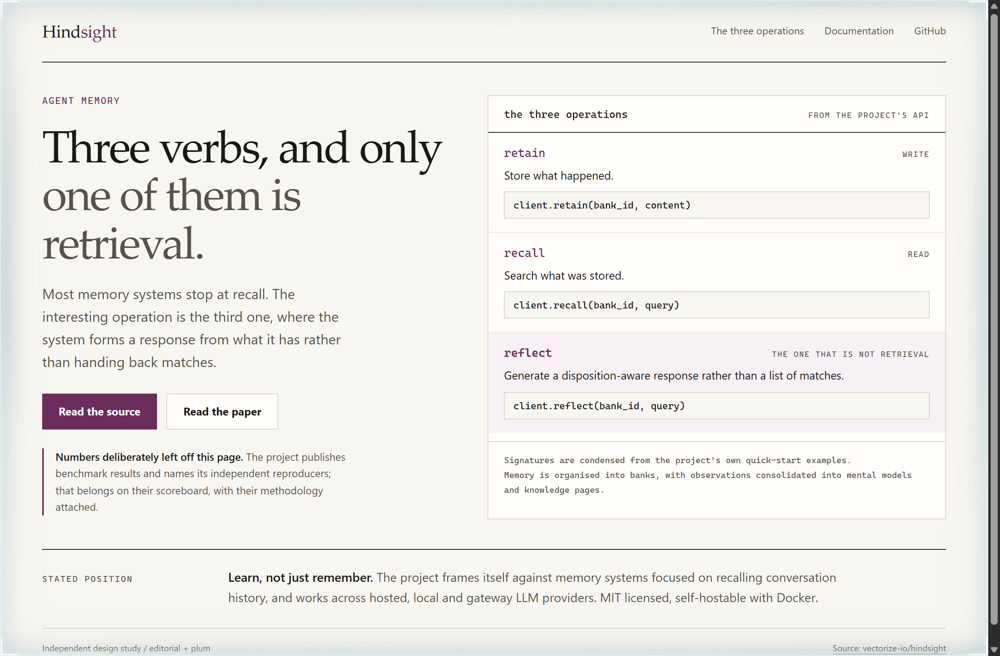
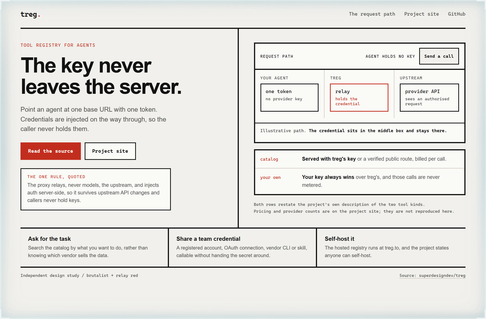
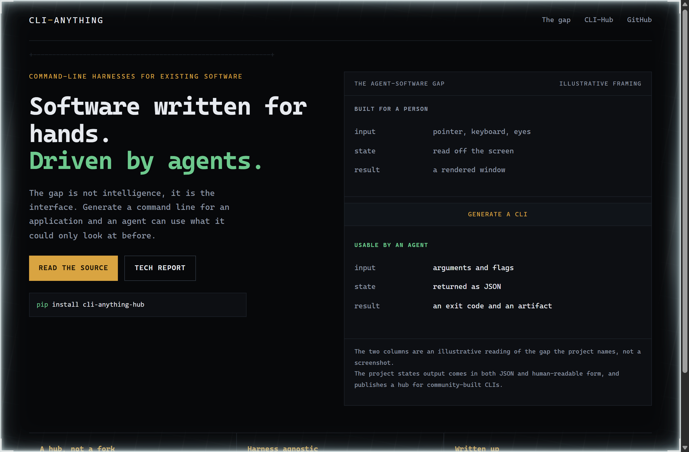

# Design Rep — Thursday, September 24

> 3 mocks — editorial, brutalist, mono-zine

[Catalog](../../CATALOG.md) · [Home](../../README.md)

## [vectorize-io/hindsight](https://github.com/vectorize-io/hindsight)

- **Style:** editorial / plum
- **Idea tested:** Give the three published operations equal rows, then tint only the one that is not retrieval
- **Verdict:** Marking reflect as the odd verb out says more than any benchmark chart would have
- [live .html](./01-hindsight.html) · [repo on GitHub](https://github.com/vectorize-io/hindsight)

## [superdesigndev/treg](https://github.com/superdesigndev/treg)

- **Style:** brutalist / relay-red
- **Idea tested:** Draw the request path as three hard boxes and let the reader watch the credential stay in the middle one
- **Verdict:** Sending a call and seeing the agent box still read no provider key is the whole security claim
- [live .html](./02-treg.html) · [repo on GitHub](https://github.com/superdesigndev/treg)

## [HKUDS/CLI-Anything](https://github.com/HKUDS/CLI-Anything)

- **Style:** mono-zine / brass
- **Idea tested:** Put the human-facing interface and the agent-facing one in the same column, separated by the thing that bridges them
- **Verdict:** Three matched rows make the interface gap concrete in a way the phrase agent-native never does
- [live .html](./03-cli-anything.html) · [repo on GitHub](https://github.com/HKUDS/CLI-Anything)
