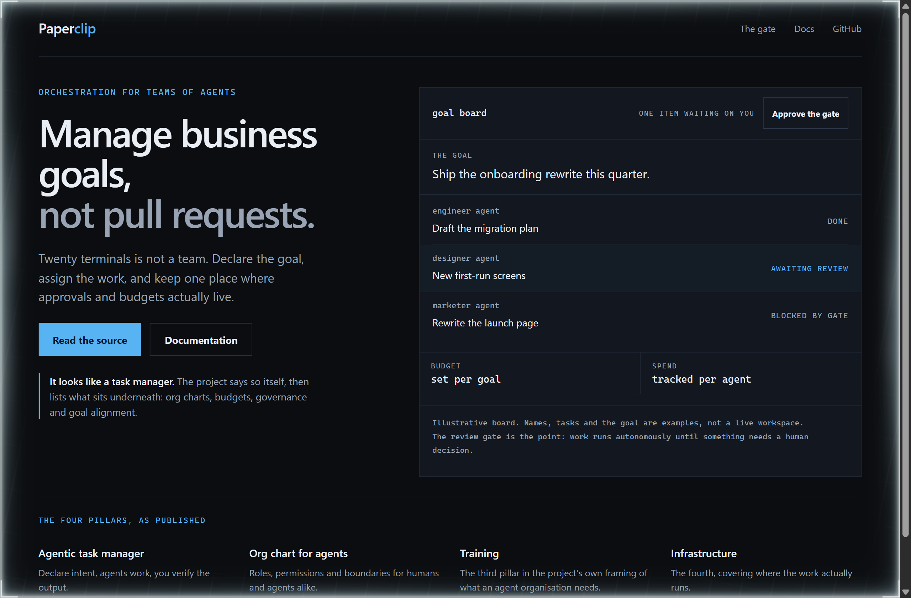
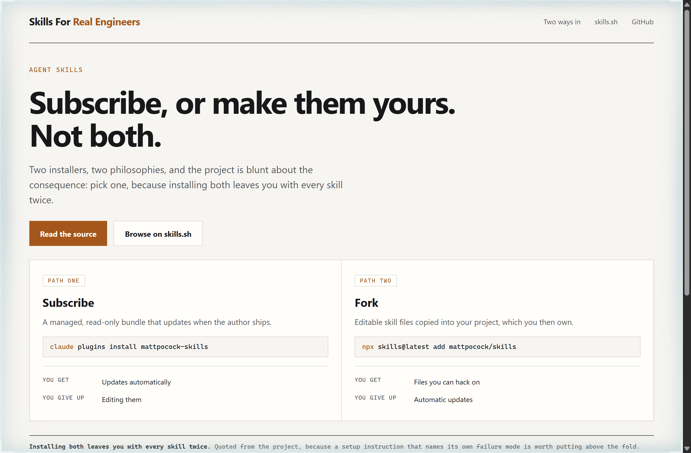
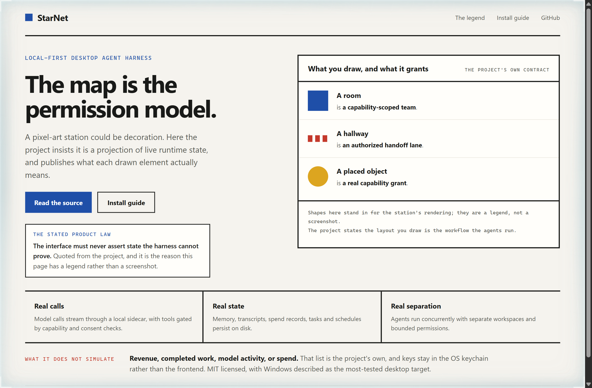

# Design Rep — Friday, September 25

> 3 mocks — terminal-dark, swiss, bauhaus

[Catalog](../../CATALOG.md) · [Home](../../README.md)

## [paperclipai/paperclip](https://github.com/paperclipai/paperclip)

- **Style:** terminal-dark / sky
- **Idea tested:** Make the review gate the interactive element, since the gate is where a human still matters
- **Verdict:** Approving one item and watching a blocked task unblock says more than any org-chart diagram
- [live .html](./01-paperclip.html) · [repo on GitHub](https://github.com/paperclipai/paperclip)

## [mattpocock/skills](https://github.com/mattpocock/skills)

- **Style:** swiss / burnt-amber
- **Idea tested:** Put the two install paths side by side with what each one costs you, because the project says you must pick one
- **Verdict:** A you give up row under each path turns a setup instruction into an actual decision
- [live .html](./02-skills.html) · [repo on GitHub](https://github.com/mattpocock/skills)

## [androoAGI/starnet](https://github.com/androoAGI/starnet)

- **Style:** bauhaus / station-blue
- **Idea tested:** Publish the legend rather than the artwork, so each drawn element is bound to the permission it grants
- **Verdict:** A legend is the honest way to show a decorative-looking interface that claims not to be decorative
- [live .html](./03-starnet.html) · [repo on GitHub](https://github.com/androoAGI/starnet)
