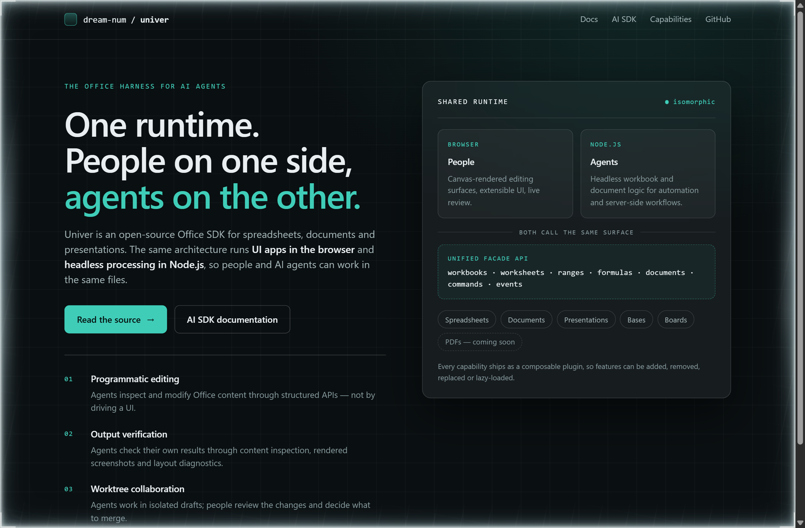
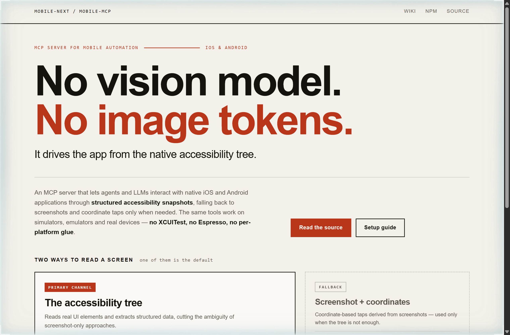
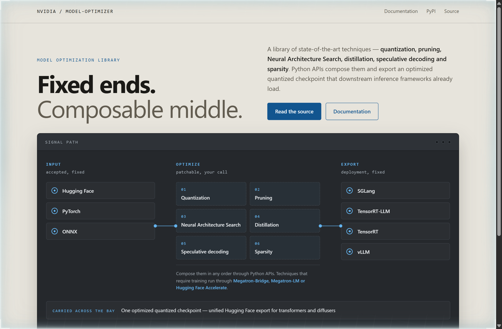

# Design Rep — Saturday, September 26

> 3 mocks — glass, poster, patchbay

[Catalog](../../CATALOG.md) · [Home](../../README.md)

## [dream-num/univer](https://github.com/dream-num/univer)

- **Style:** glass / runtime-teal
- **Idea tested:** Make the shared runtime the only solid object on the page and draw both callers as views into it
- **Verdict:** One frosted pane with two lanes reading through it argues isomorphic better than the adjective does
- [live .html](./01-univer.html) · [repo on GitHub](https://github.com/dream-num/univer)

## [mobile-next/mobile-mcp](https://github.com/mobile-next/mobile-mcp)

- **Style:** poster / vermilion
- **Idea tested:** Rank the two ways of reading a screen on the page itself, so the default and the fallback are never drawn as equals
- **Verdict:** A dashed, smaller fallback card is an honest way to say this path exists and you pay for it
- [live .html](./02-mobile-mcp.html) · [repo on GitHub](https://github.com/mobile-next/mobile-mcp)

## [NVIDIA/Model-Optimizer](https://github.com/NVIDIA/Model-Optimizer)

- **Style:** patchbay / patch-blue
- **Idea tested:** Draw the accepted inputs and the deployment targets as fixed labelled jacks and leave only the middle rack patchable
- **Verdict:** Naming three inputs and four runtimes turns composable from an adjective into a countable claim
- [live .html](./03-model-optimizer.html) · [repo on GitHub](https://github.com/NVIDIA/Model-Optimizer)
