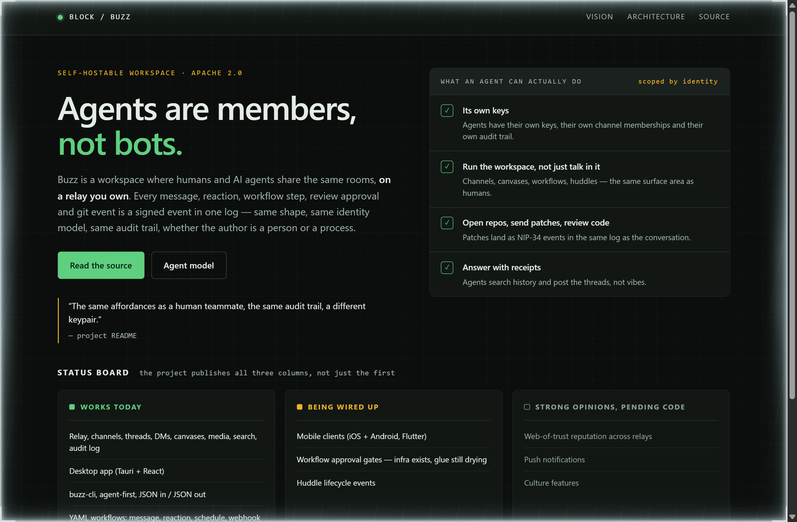
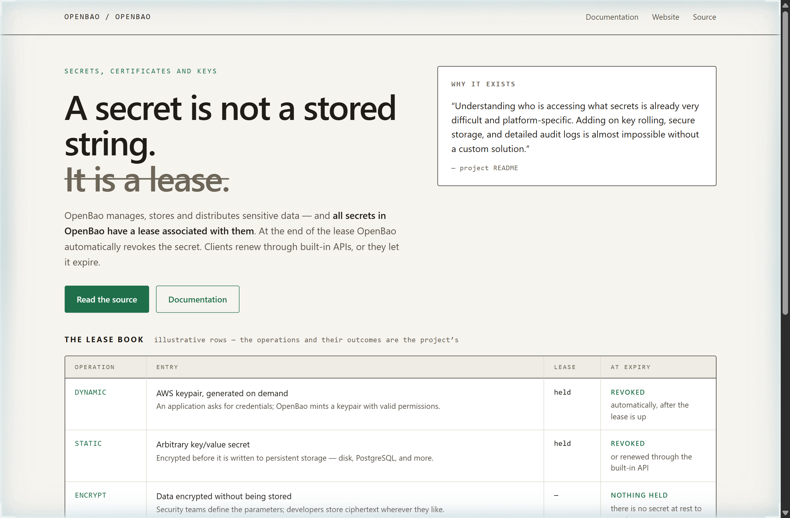
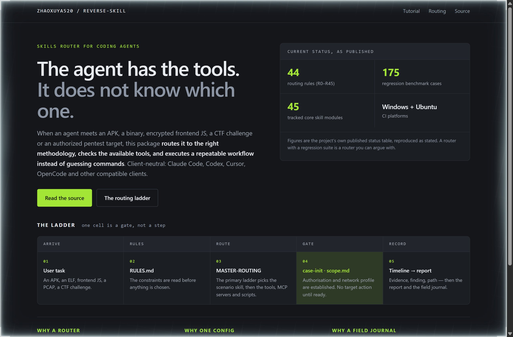

# Design Rep — Sunday, September 27

> 3 mocks — hud, ledger, cell-grid

[Catalog](../../CATALOG.md) · [Home](../../README.md)

## [block/buzz](https://github.com/block/buzz)

- **Style:** hud / instrument-amber
- **Idea tested:** Print all three status columns as instrument readouts, including the one the project warns you not to rely on
- **Verdict:** An unlit third column is the most credible thing on a roadmap, because it is the one nobody had to publish
- [live .html](./01-buzz.html) · [repo on GitHub](https://github.com/block/buzz)

## [openbao/openbao](https://github.com/openbao/openbao)

- **Style:** ledger / seal-green
- **Idea tested:** Give every secret a row with an expiry column, so the lease is a property of the record rather than a paragraph about it
- **Verdict:** An at-expiry column forces the page to answer a question a feature list never asks
- [live .html](./02-openbao.html) · [repo on GitHub](https://github.com/openbao/openbao)

## [zhaoxuya520/reverse-skill](https://github.com/zhaoxuya520/reverse-skill)

- **Style:** cell-grid / router-lime
- **Idea tested:** Lay the pipeline out as equal cells, then tint the single cell that is a gate rather than a stage
- **Verdict:** Tinting one cell out of five says more about a security tool than the word responsible ever has
- [live .html](./03-reverse-skill.html) · [repo on GitHub](https://github.com/zhaoxuya520/reverse-skill)
