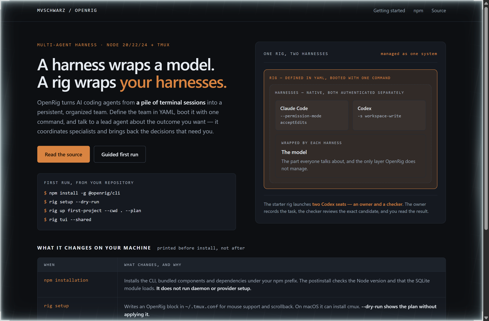
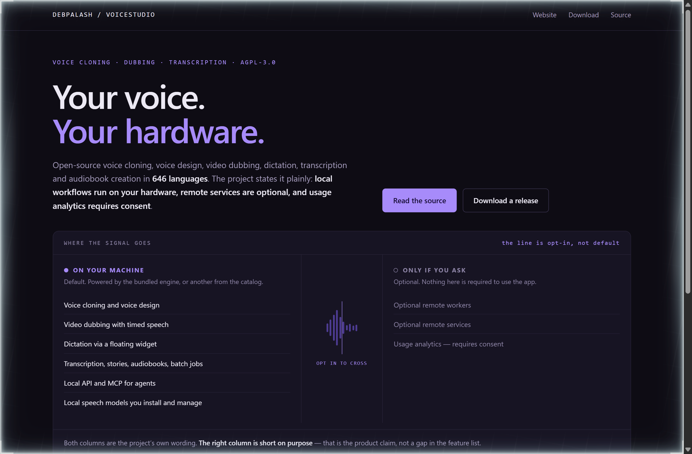
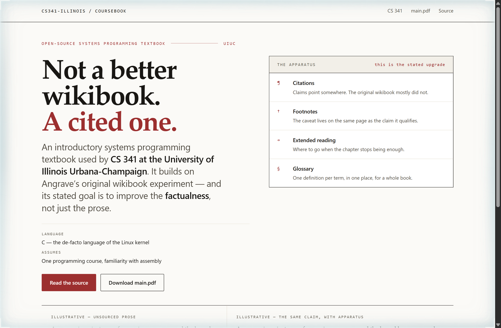

# Design Rep — Monday, September 28

> 3 mocks — strata, waveform, specimen

[Catalog](../../CATALOG.md) · [Home](../../README.md)

## [mvschwarz/openrig](https://github.com/mvschwarz/openrig)

- **Style:** strata / rig-copper
- **Idea tested:** Draw the project own sentence as literal nested strata, and let the innermost band be the layer it does not manage
- **Verdict:** Nesting the model innermost makes the pitch structural, because the page argues by containment rather than by adjective
- [live .html](./01-openrig.html) · [repo on GitHub](https://github.com/mvschwarz/openrig)

## [debpalash/VoiceStudio](https://github.com/debpalash/VoiceStudio)

- **Style:** waveform / signal-violet
- **Idea tested:** Put the local and remote columns either side of a waveform that visibly loses amplitude at the boundary
- **Verdict:** Amplitude dropping at the line does the work a lock icon usually pretends to do
- [live .html](./02-voicestudio.html) · [repo on GitHub](https://github.com/debpalash/VoiceStudio)

## [cs341-illinois/coursebook](https://github.com/cs341-illinois/coursebook)

- **Style:** specimen / ink-crimson
- **Idea tested:** Make the scholarly apparatus the hero, and prove it with the same paragraph printed twice
- **Verdict:** Printing the same sentence with and without its apparatus is a better argument for rigour than the word rigour
- [live .html](./03-coursebook.html) · [repo on GitHub](https://github.com/cs341-illinois/coursebook)
