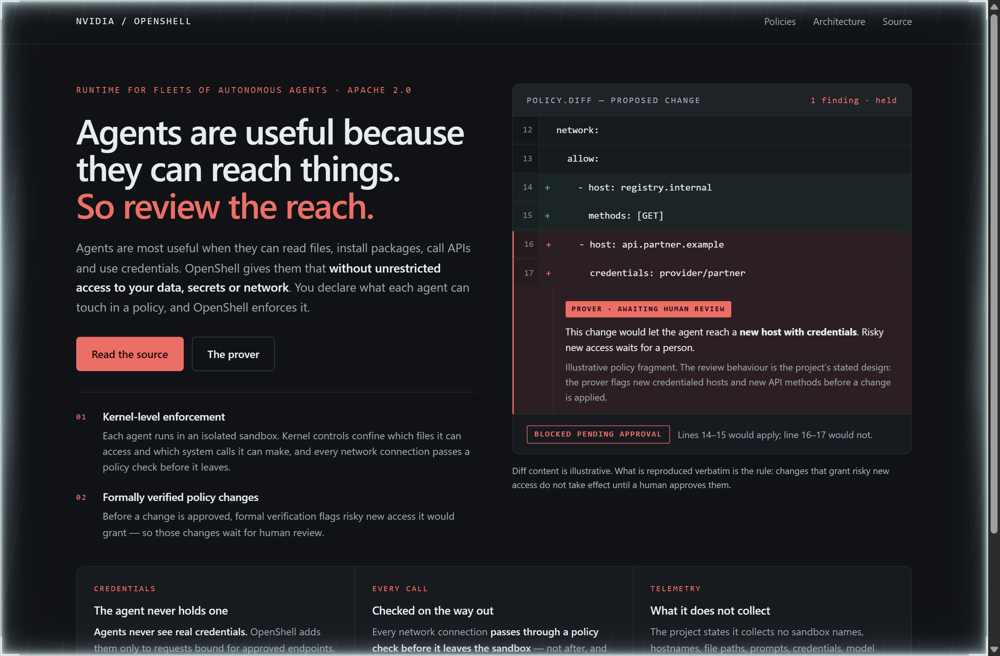
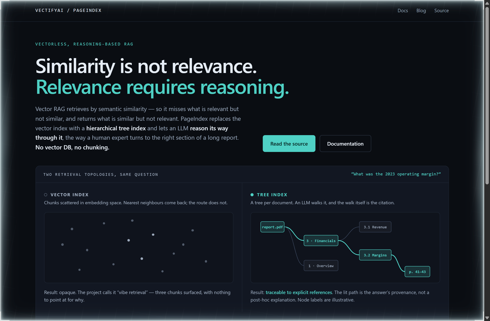
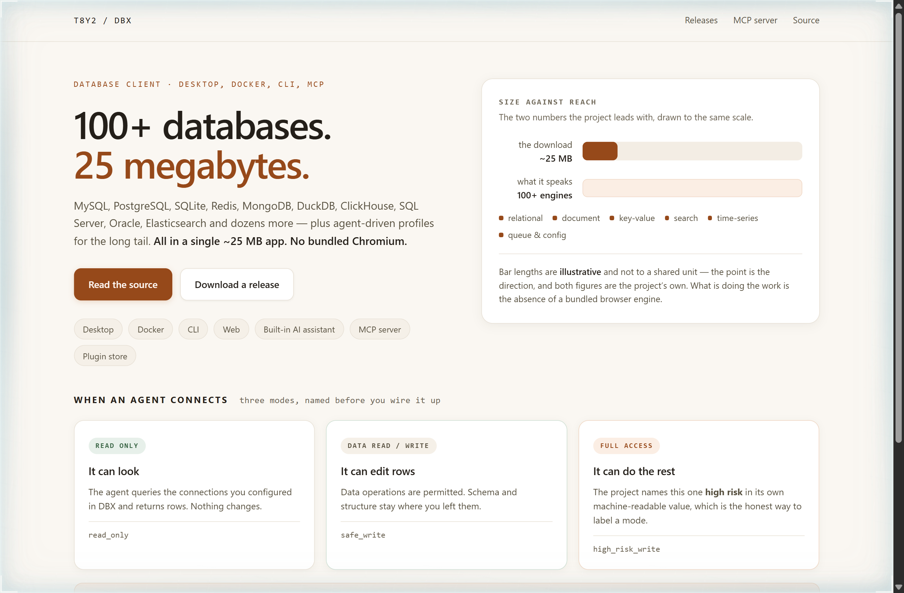

# Design Rep — Tuesday, September 29

> 3 mocks — redline, constellation, warm-minimal

[Catalog](../../CATALOG.md) · [Home](../../README.md)

## [NVIDIA/OpenShell](https://github.com/NVIDIA/OpenShell)

- **Style:** redline / containment-red
- **Idea tested:** Draw the product as a marked-up policy diff, and let the flagged line be the only thing the page asks you to look at
- **Verdict:** A margin annotation holding two lines back is a more specific promise than the word governance
- [live .html](./01-openshell.html) · [repo on GitHub](https://github.com/NVIDIA/OpenShell)

## [VectifyAI/PageIndex](https://github.com/VectifyAI/PageIndex)

- **Style:** constellation / node-teal
- **Idea tested:** Put the two retrieval topologies side by side under one question, so traceability reads as a shape rather than a feature
- **Verdict:** Drawing the traversal as the citation is the clearest argument for reasoning-based retrieval yet
- [live .html](./02-pageindex.html) · [repo on GitHub](https://github.com/VectifyAI/PageIndex)

## [t8y2/dbx](https://github.com/t8y2/dbx)

- **Style:** warm-minimal / clay
- **Idea tested:** Lead with the size-to-reach ratio, then spend the second half on the three permission modes an agent inherits
- **Verdict:** Printing high_risk_write under the third card is the kind of self-labelling that earns trust in one glance
- [live .html](./03-dbx.html) · [repo on GitHub](https://github.com/t8y2/dbx)
