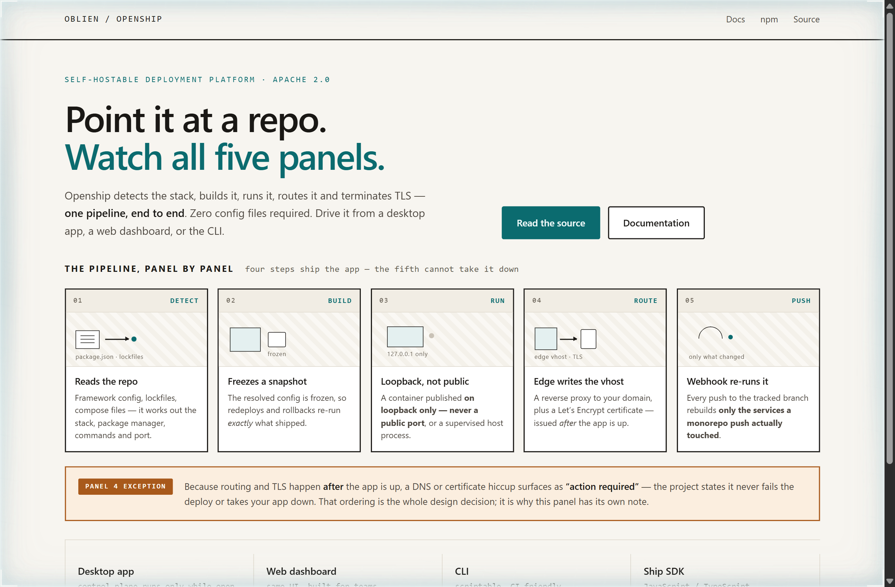
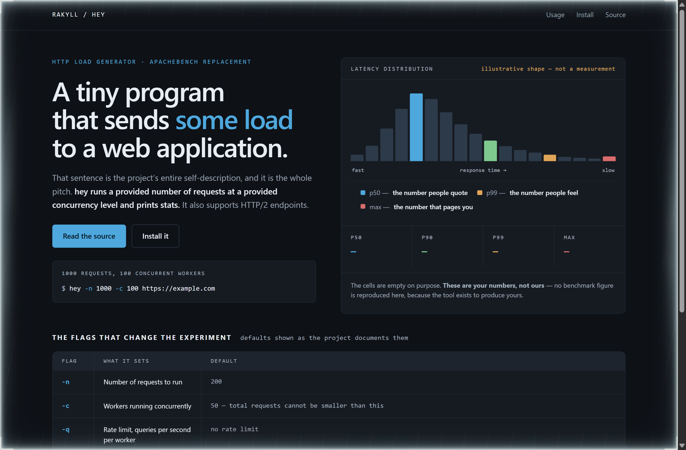
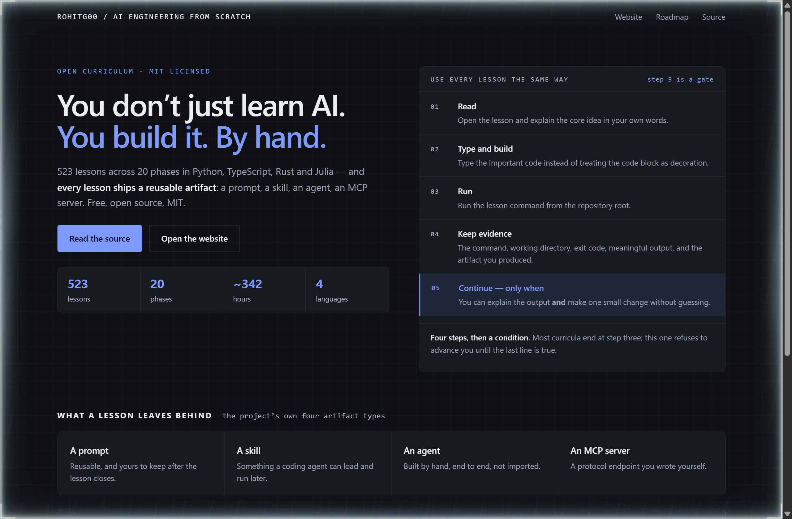

# Design Rep — Wednesday, September 30

> 3 mocks — storyboard, data-viz, blueprint

[Catalog](../../CATALOG.md) · [Home](../../README.md)

## [oblien/openship](https://github.com/oblien/openship)

- **Style:** storyboard / deploy-teal
- **Idea tested:** Draw the five-stage pipeline as literal storyboard cels, then give the one panel with an ordering caveat its own exception strip
- **Verdict:** Giving one panel an exception strip is how you show that an ordering choice, not a feature, is the product
- [live .html](./01-openship.html) · [repo on GitHub](https://github.com/oblien/openship)

## [rakyll/hey](https://github.com/rakyll/hey)

- **Style:** data-viz / percentile-blue
- **Idea tested:** Build the whole page around a latency chart, then leave every result cell empty because the numbers are not mine to fill in
- **Verdict:** An empty result cell is the most honest thing a benchmarking tool landing page can show
- [live .html](./02-hey.html) · [repo on GitHub](https://github.com/rakyll/hey)

## [rohitg00/ai-engineering-from-scratch](https://github.com/rohitg00/ai-engineering-from-scratch)

- **Style:** blueprint / ink-blue
- **Idea tested:** Print the five-step lesson loop as drafted rows and tint only the fifth, because the fifth is a condition rather than an instruction
- **Verdict:** Tinting the row that is a gate turns a study method into a harness, which is the more accurate description
- [live .html](./03-ai-engineering.html) · [repo on GitHub](https://github.com/rohitg00/ai-engineering-from-scratch)
