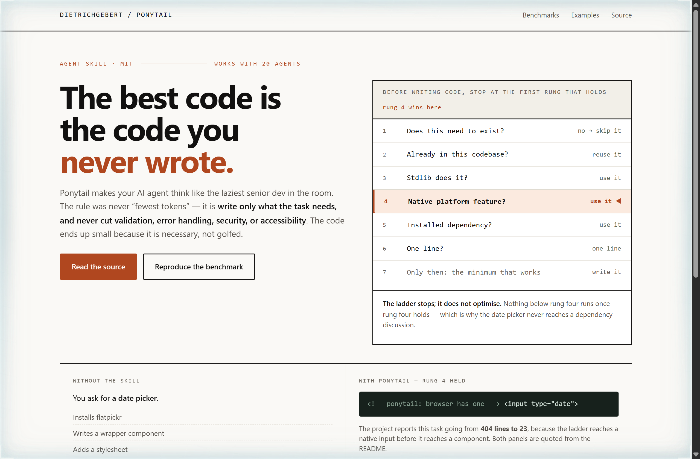
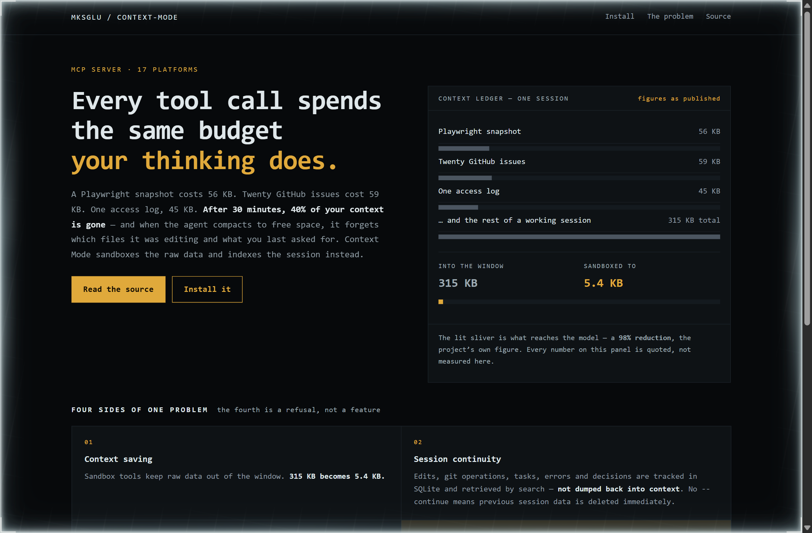
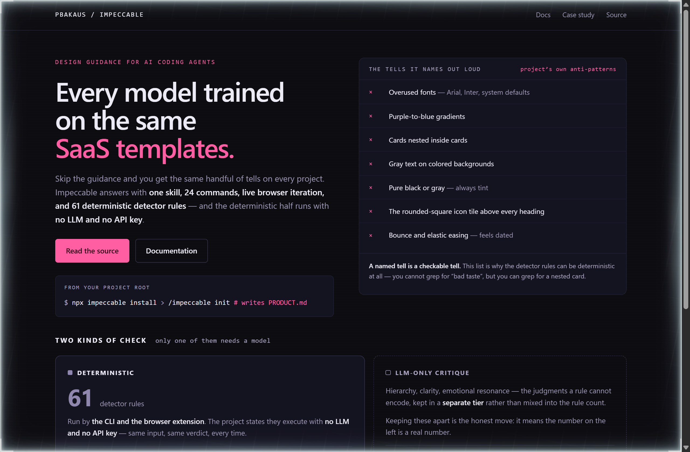

# Design Rep — Thursday, October 1

> 3 mocks — editorial, mono-zine, neon-noir

[Catalog](../../CATALOG.md) · [Home](../../README.md)

## [DietrichGebert/ponytail](https://github.com/DietrichGebert/ponytail)

- **Style:** editorial / stop-rust
- **Idea tested:** Print the seven-rung ladder in full and highlight the rung that fires for the example beside it, so the mechanism and the outcome share one screen
- **Verdict:** Lighting the rung that fired turns a rule list into a trace, and a trace is what makes the example believable
- [live .html](./01-ponytail.html) · [repo on GitHub](https://github.com/DietrichGebert/ponytail)

## [mksglu/context-mode](https://github.com/mksglu/context-mode)

- **Style:** mono-zine / budget-amber
- **Idea tested:** Draw the context window as a spend ledger with every line item costed, then show the sandboxed total as a single lit sliver
- **Verdict:** A sliver you have to look for is a more honest rendering of a 98 percent claim than any badge
- [live .html](./02-context-mode.html) · [repo on GitHub](https://github.com/mksglu/context-mode)

## [pbakaus/impeccable](https://github.com/pbakaus/impeccable)

- **Style:** neon-noir / detector-pink
- **Idea tested:** Separate the checks that need a model from the ones that do not, and give the deterministic count the solid card
- **Verdict:** Giving the deterministic number the solid card is what stops 61 from reading as marketing
- [live .html](./03-impeccable.html) · [repo on GitHub](https://github.com/pbakaus/impeccable)
