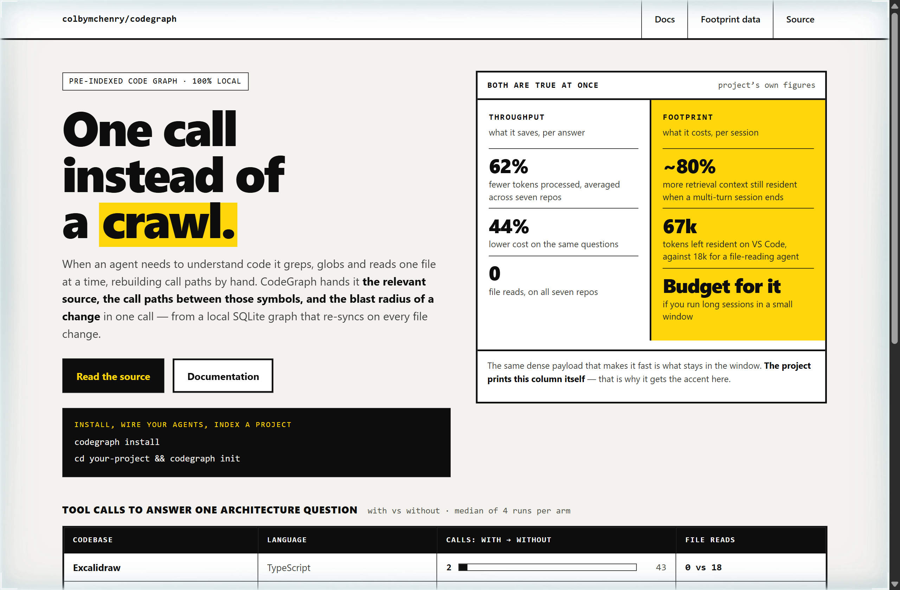
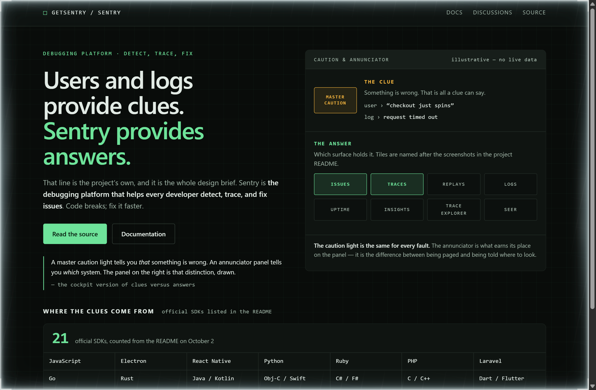
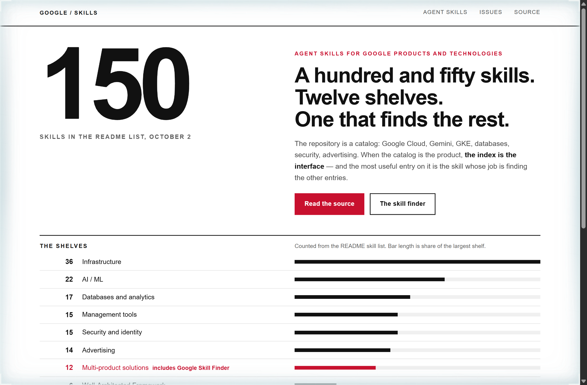

# Design Rep — Friday, October 2

> 3 mocks — brutalist, hud, swiss

[Catalog](../../CATALOG.md) · [Home](../../README.md)

## [colbymchenry/codegraph](https://github.com/colbymchenry/codegraph)

- **Style:** brutalist / hazard-yellow
- **Idea tested:** Put the throughput savings and the session footprint on one scale with equal type, and give the accent to the cost column
- **Verdict:** Printing the cost the project discloses at the same size as the win is what makes the win believable
- [live .html](./01-codegraph.html) · [repo on GitHub](https://github.com/colbymchenry/codegraph)

## [getsentry/sentry](https://github.com/getsentry/sentry)

- **Style:** hud / phosphor-green
- **Idea tested:** Draw the project tagline as a master caution light above an annunciator grid, so the clue and the answer become two different instruments
- **Verdict:** A caution light that can only say something is wrong is the clearest way to show what an answer adds
- [live .html](./02-sentry.html) · [repo on GitHub](https://github.com/getsentry/sentry)

## [google/skills](https://github.com/google/skills)

- **Style:** swiss / index-red
- **Idea tested:** Make the twelve-shelf index the hero, and give the only accent to the skill that finds the other skills
- **Verdict:** When the catalog is the product, the index is the interface, and the finder is the one row worth colouring
- [live .html](./03-google-skills.html) · [repo on GitHub](https://github.com/google/skills)
