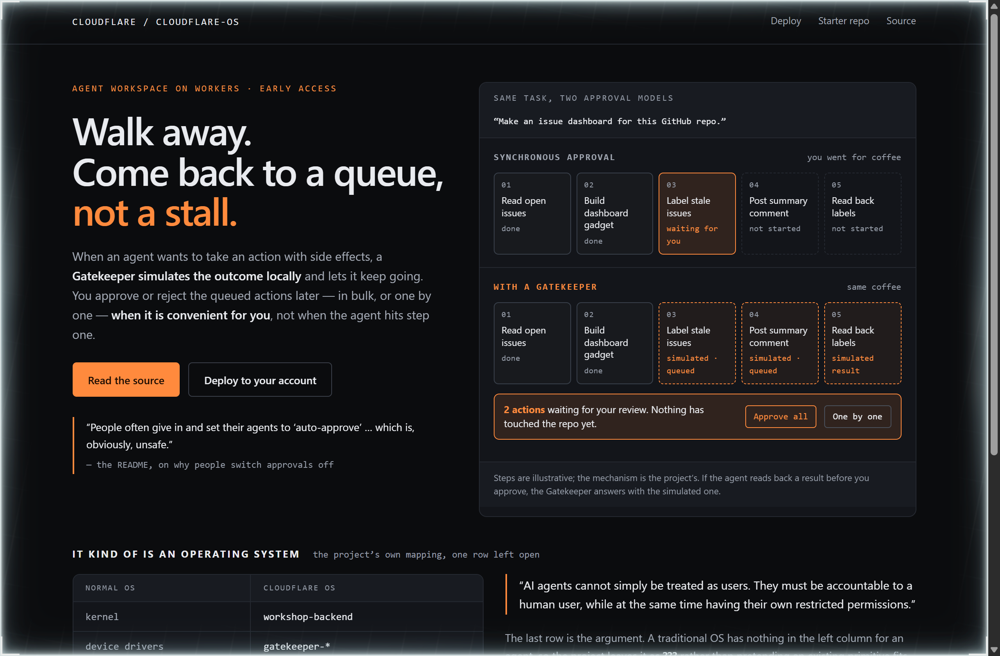
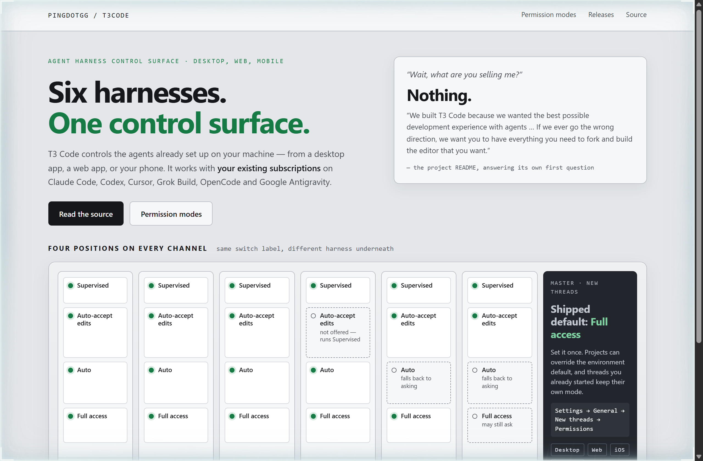
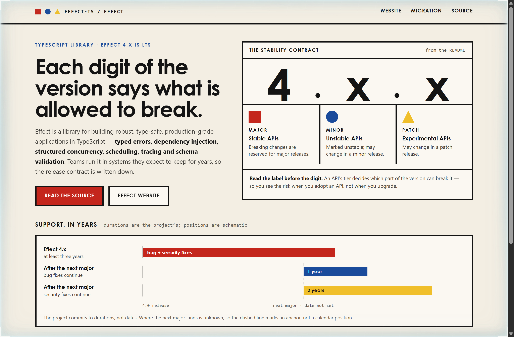

# Design Rep — Saturday, October 3

> 3 mocks — terminal-dark, patchbay, bauhaus

[Catalog](../../CATALOG.md) · [Home](../../README.md)

## [cloudflare/cloudflare-os](https://github.com/cloudflare/cloudflare-os)

- **Style:** terminal-dark / workers-orange
- **Idea tested:** Run the same task through synchronous approval and a Gatekeeper side by side, so the stall and the queue share one screen
- **Verdict:** A stalled lane beside a queued one explains deferred approval faster than the paragraph that describes it
- [live .html](./01-cloudflare-os.html) · [repo on GitHub](https://github.com/cloudflare/cloudflare-os)

## [pingdotgg/t3code](https://github.com/pingdotgg/t3code)

- **Style:** patchbay / led-green
- **Idea tested:** Draw the four permission modes as buttons on six channel strips, and hollow out only the cells the docs say behave differently
- **Verdict:** One switch label across six harnesses only stays honest when the exceptions sit on the exact cells they modify
- [live .html](./02-t3code.html) · [repo on GitHub](https://github.com/pingdotgg/t3code)

## [Effect-TS/effect](https://github.com/Effect-TS/effect)

- **Style:** bauhaus / version-red
- **Idea tested:** Set the version number huge and hang each API stability tier under the digit that is allowed to break it
- **Verdict:** Tying each tier to a digit turns a release policy into something you can read off the version number
- [live .html](./03-effect.html) · [repo on GitHub](https://github.com/Effect-TS/effect)
