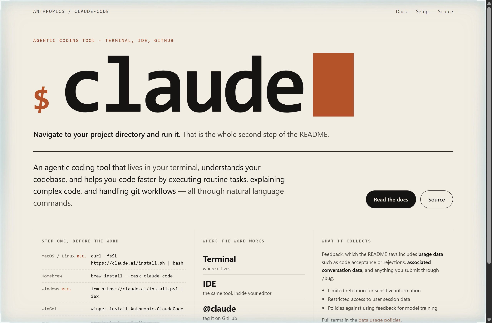
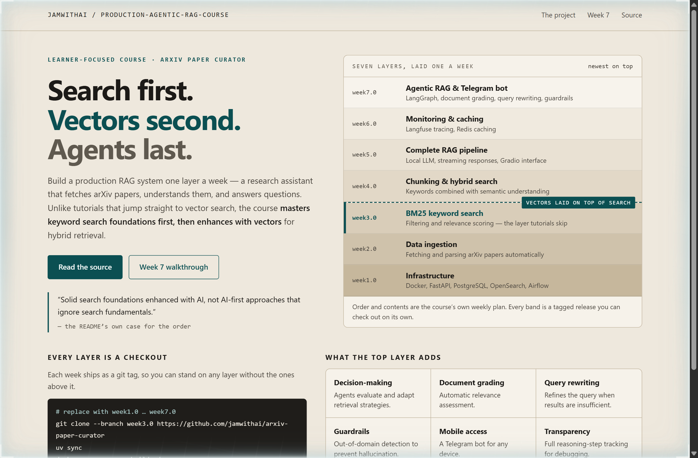
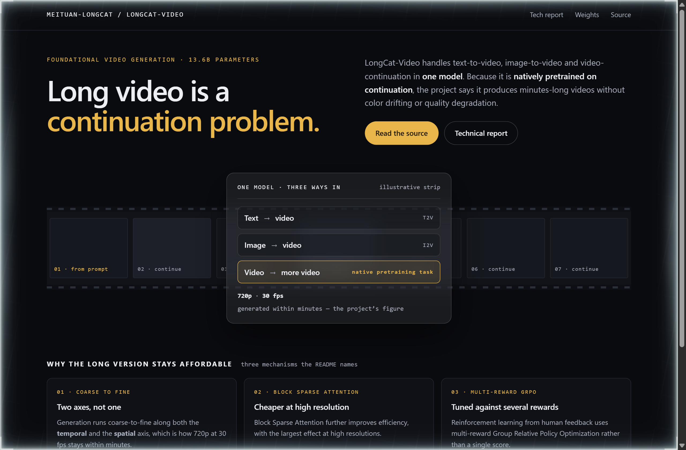

# Design Rep — Sunday, October 4

> 3 mocks — poster, strata, glass

[Catalog](../../CATALOG.md) · [Home](../../README.md)

## [anthropics/claude-code](https://github.com/anthropics/claude-code)

- **Style:** poster / clay
- **Idea tested:** Set the single command as the poster headline, and strike through the install path the project has deprecated
- **Verdict:** When the whole entry point is one word, that word is the headline and everything else is setup
- [live .html](./01-claude-code.html) · [repo on GitHub](https://github.com/anthropics/claude-code)

## [jamwithai/production-agentic-rag-course](https://github.com/jamwithai/production-agentic-rag-course)

- **Style:** strata / bedrock-teal
- **Idea tested:** Stack the seven weekly releases as strata and mark the seam where vectors are laid on top of keyword search
- **Verdict:** Drawing search beneath vectors makes the course argument physical, because you can see what the newer layer rests on
- [live .html](./02-agentic-rag-course.html) · [repo on GitHub](https://github.com/jamwithai/production-agentic-rag-course)

## [meituan-longcat/LongCat-Video](https://github.com/meituan-longcat/LongCat-Video)

- **Style:** glass / reel-gold
- **Idea tested:** Run a filmstrip of continuations behind one frosted pane, and light only the entry point the model was pretrained on
- **Verdict:** Lighting continuation rather than text-to-video is what makes the minutes-long claim plausible at a glance
- [live .html](./03-longcat-video.html) · [repo on GitHub](https://github.com/meituan-longcat/LongCat-Video)
