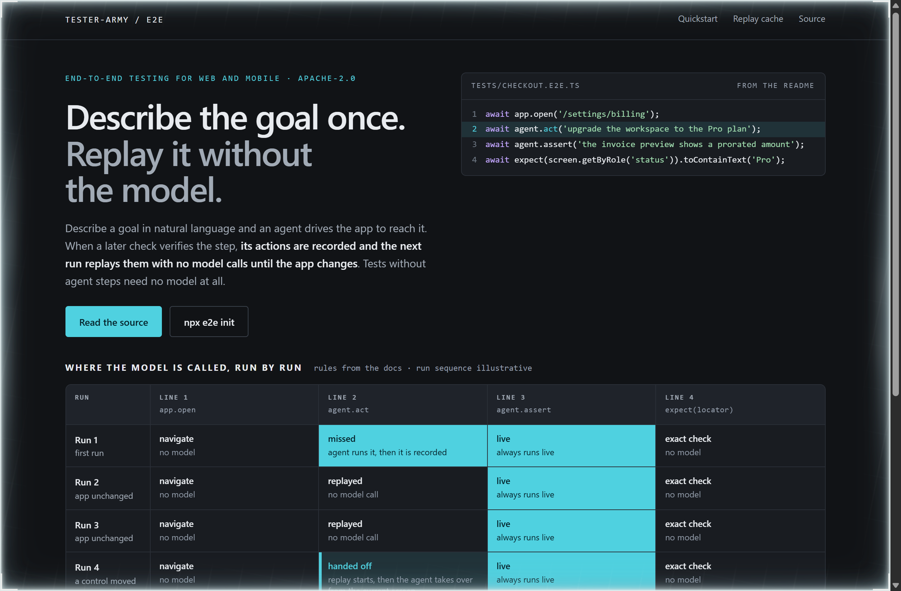
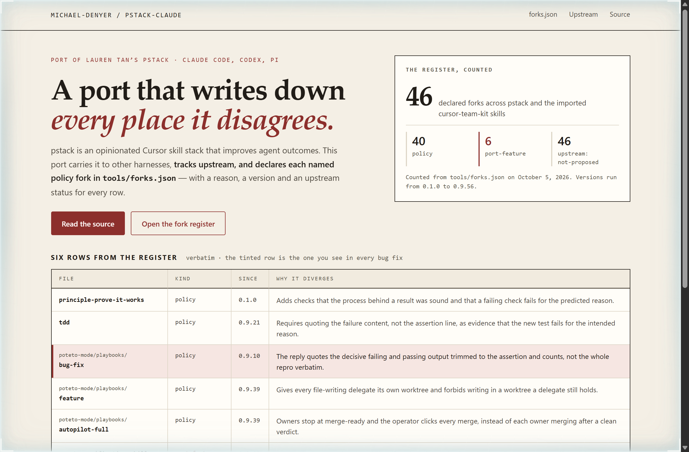
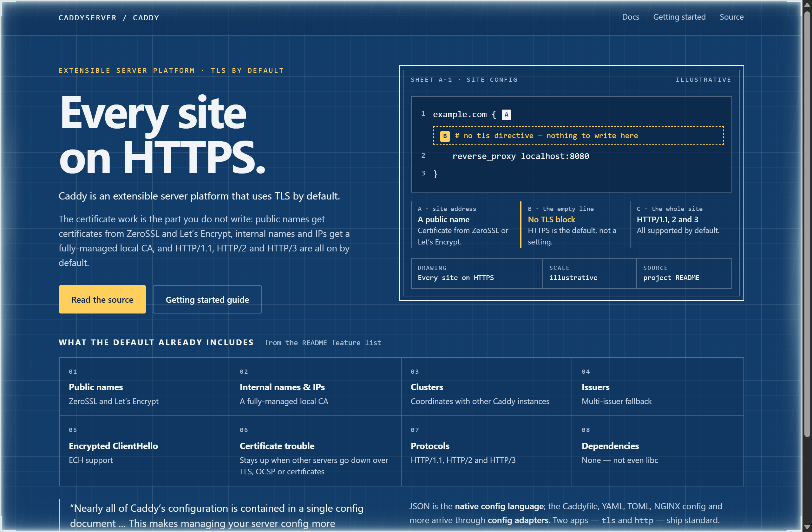

# Design Rep — Monday, October 5

> 3 mocks — cell-grid, ledger, blueprint

[Catalog](../../CATALOG.md) · [Home](../../README.md)

## [tester-army/e2e](https://github.com/tester-army/e2e)

- **Style:** cell-grid / replay-cyan
- **Idea tested:** Lay the four-line README test out as columns and the runs as rows, so you can see which line stops calling the model and which never will
- **Verdict:** Seeing agent.act go quiet while agent.assert stays live explains the cost model better than any token figure
- [live .html](./01-e2e.html) · [repo on GitHub](https://github.com/tester-army/e2e)

## [michael-denyer/pstack-claude](https://github.com/michael-denyer/pstack-claude)

- **Style:** ledger / fork-oxblood
- **Idea tested:** Print the fork register of the port as the hero, so its divergences from upstream read as a ledger rather than a changelog
- **Verdict:** A register beats a changelog for a port, because the reader sees what was changed on purpose, with a reason, before anything else
- [live .html](./02-pstack.html) · [repo on GitHub](https://github.com/michael-denyer/pstack-claude)

## [caddyserver/caddy](https://github.com/caddyserver/caddy)

- **Style:** blueprint / cyanotype-amber
- **Idea tested:** Draw the minimal config as a blueprint sheet and dimension the line you never have to write
- **Verdict:** Dimensioning an empty line is the clearest way to show a default, because the thing you did not write is the feature
- [live .html](./03-caddy.html) · [repo on GitHub](https://github.com/caddyserver/caddy)
