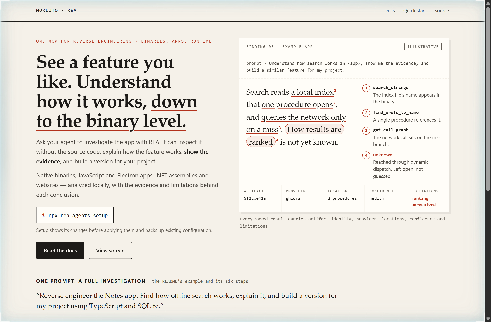
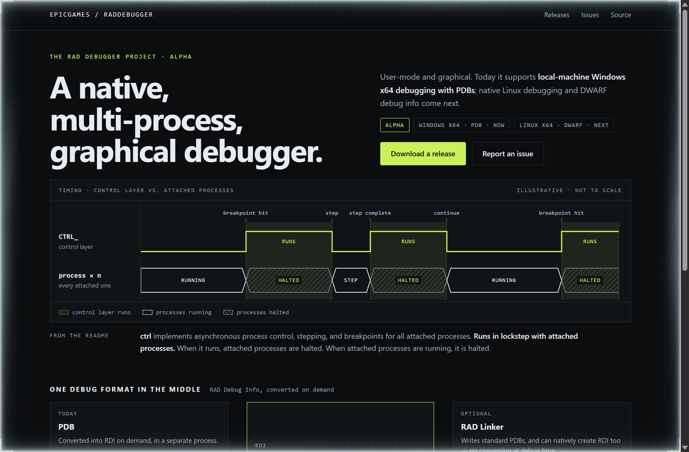
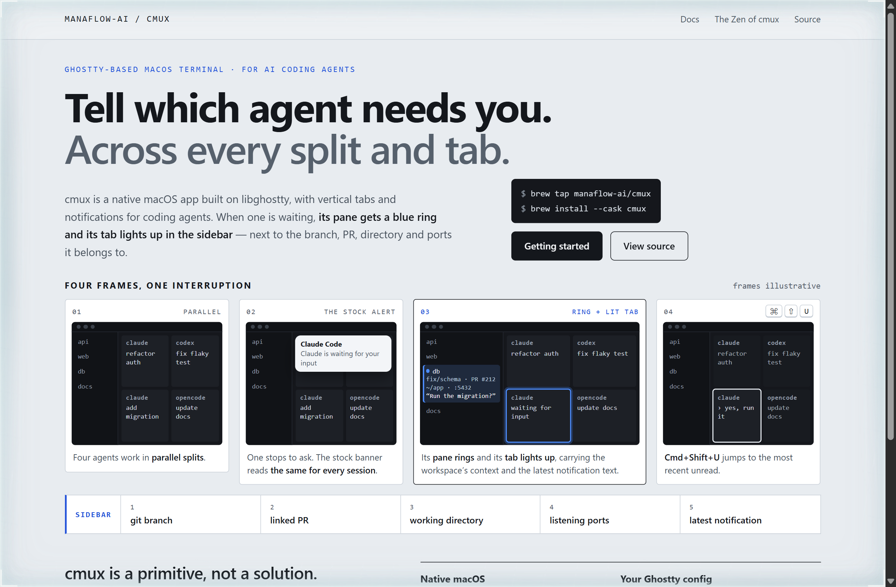

# Design Rep — Wednesday, October 7

> 3 mocks — redline, waveform, storyboard

[Catalog](../../CATALOG.md) · [Home](../../README.md)

## [morluto/rea](https://github.com/morluto/rea)

- **Style:** redline / evidence-vermilion
- **Idea tested:** Mark up a finding like a proof, tying each claim to the REA tool that supports it and circling the one it could not resolve as unknown
- **Verdict:** Circling the one unknown builds more trust than a capability list, because it shows the tool will not guess
- [live .html](./01-rea.html) · [repo on GitHub](https://github.com/morluto/rea)

## [EpicGames/raddebugger](https://github.com/EpicGames/raddebugger)

- **Style:** waveform / lockstep-lime
- **Idea tested:** Draw the README's lockstep sentence as a timing diagram, with the control layer and every attached process never high together
- **Verdict:** Drawn as two traces that are never high together, one architecture sentence becomes the hero
- [live .html](./02-raddebugger.html) · [repo on GitHub](https://github.com/EpicGames/raddebugger)

## [manaflow-ai/cmux](https://github.com/manaflow-ai/cmux)

- **Style:** storyboard / ring-blue
- **Idea tested:** Storyboard the interruption in four frames and give the ring frame the widest cel, so the stock alert and the lit tab sit side by side
- **Verdict:** Setting the stock banner beside the lit tab argues for context without a single adjective
- [live .html](./03-cmux.html) · [repo on GitHub](https://github.com/manaflow-ai/cmux)
