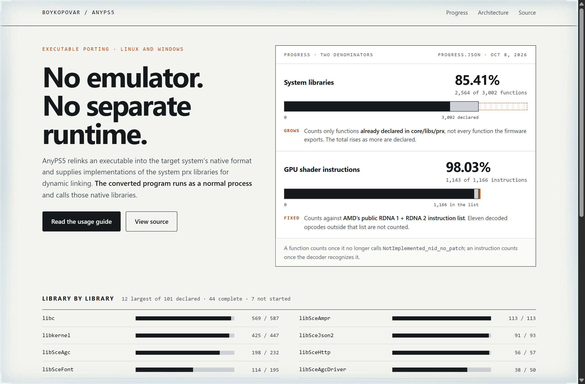
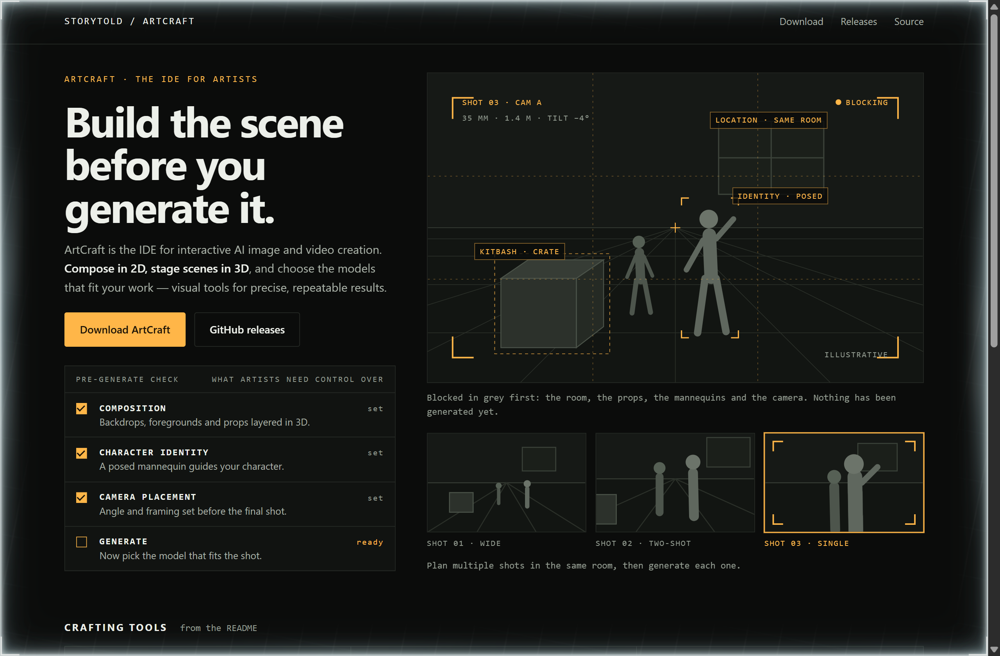
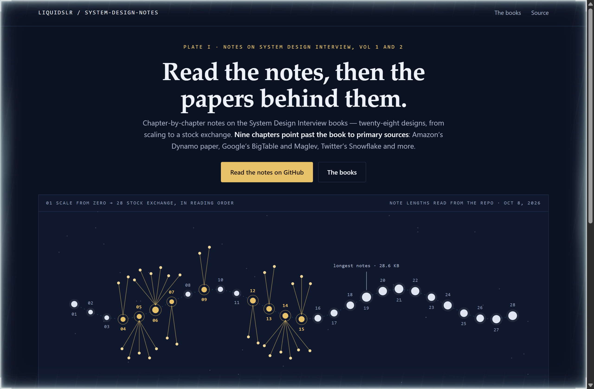

# Design Rep — Thursday, October 8

> 3 mocks — data-viz, hud, constellation

[Catalog](../../CATALOG.md) · [Home](../../README.md)

## [boykopovar/AnyPS5](https://github.com/boykopovar/AnyPS5)

- **Style:** data-viz / denominator-orange
- **Idea tested:** Set the two progress bars side by side and draw their denominators differently, an open dashed end for the library total that grows and a hard wall for the fixed shader list
- **Verdict:** Two percentages that look alike read honestly only when the page shows what each one is divided by
- [live .html](./01-anyps5.html) · [repo on GitHub](https://github.com/boykopovar/AnyPS5)

## [storytold/artcraft](https://github.com/storytold/artcraft)

- **Style:** hud / viewfinder-amber
- **Idea tested:** Frame the hero as a camera viewfinder over a grey blocked-out scene, with a pre-generate checklist for composition, character identity and camera
- **Verdict:** A checklist in front of the generate button turns prompting into staging, which is the product's whole argument
- [live .html](./02-artcraft.html) · [repo on GitHub](https://github.com/storytold/artcraft)

## [liquidslr/system-design-notes](https://github.com/liquidslr/system-design-notes)

- **Style:** constellation / atlas-gold
- **Idea tested:** Map the 28 chapters as a star chart sized by note length, with gold fans out to each chapter's listed primary sources
- **Verdict:** The chart shows where the notes reach past the book and where they do not yet, with no commentary needed
- [live .html](./03-system-design-notes.html) · [repo on GitHub](https://github.com/liquidslr/system-design-notes)
