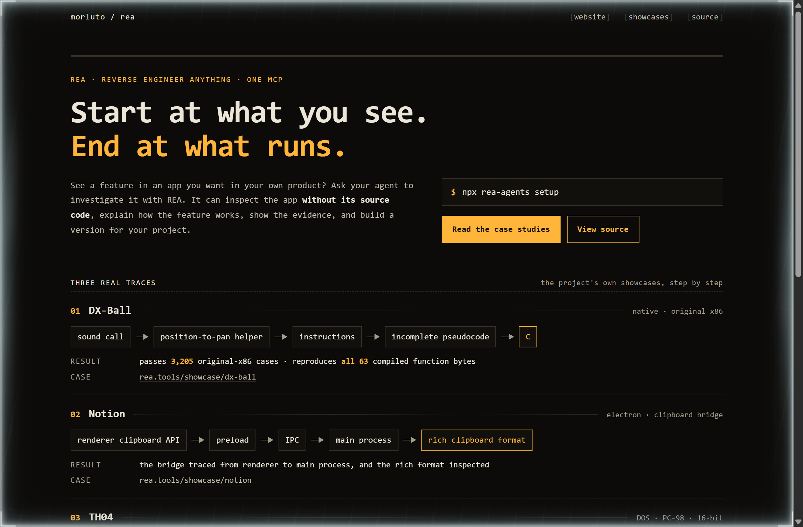
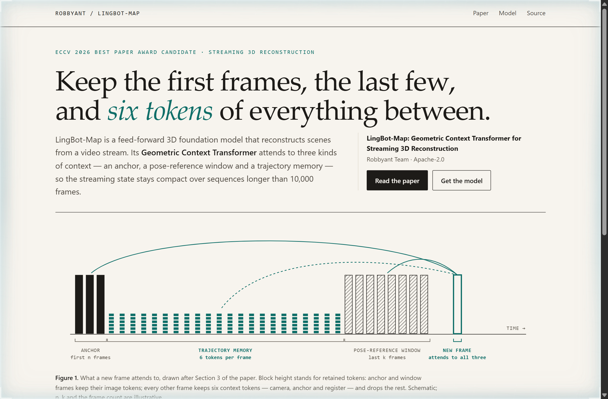
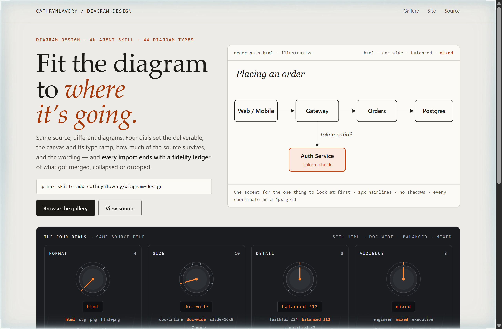

# Design Rep — Saturday, October 10

> 3 mocks — mono-zine, editorial, patchbay

[Catalog](../../CATALOG.md) · [Home](../../README.md)

## [morluto/rea](https://github.com/morluto/rea)

- **Style:** mono-zine / trace-amber
- **Idea tested:** Replace the illustrative finding with the project's three real showcases, each drawn as a hop-by-hop trace from the feature you see to the code that runs
- **Verdict:** Real traces carry more weight than an illustrative finding, because each one ends at a result someone can check
- [live .html](./01-rea.html) · [repo on GitHub](https://github.com/morluto/rea)

## [Robbyant/lingbot-map](https://github.com/Robbyant/lingbot-map)

- **Style:** editorial / memory-teal
- **Idea tested:** Draw the paper's attention design as one row of frames, full height for the first and last frames and six small tokens for every frame between
- **Verdict:** Drawing token counts as block height makes compact streaming state something you can see rather than take on trust
- [live .html](./02-lingbot-map.html) · [repo on GitHub](https://github.com/Robbyant/lingbot-map)

## [cathrynlavery/diagram-design](https://github.com/cathrynlavery/diagram-design)

- **Style:** patchbay / dial-orange
- **Idea tested:** Set the README's four dials on a patch panel and drive one illustrative diagram from them, with the fidelity ledger as the receipt
- **Verdict:** Dials plus a receipt explain an output-fitting tool better than a gallery does, because they show what changed and what was dropped
- [live .html](./03-diagram-design.html) · [repo on GitHub](https://github.com/cathrynlavery/diagram-design)
